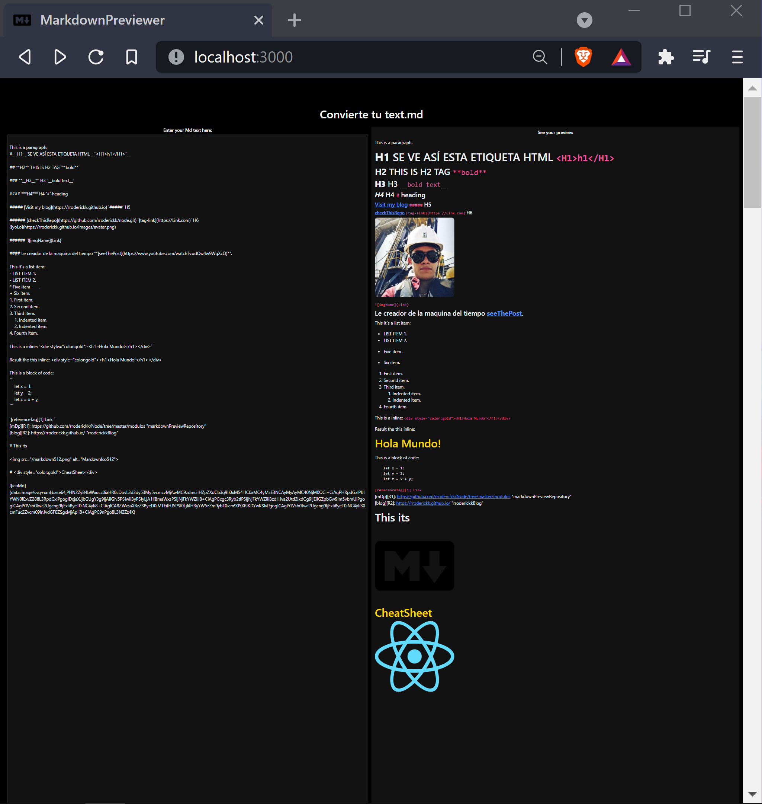

#### Para el portafolio estuve trasteando un poco aqui con CRA, NPM, BootStrap, HTML, CSS, JS, JSX tienes un MarkDown Previsualizer con un respectivo MardownCHEATSEET para escribir blogs, aunque tambien existen extensiones para VSC.



#### Dentro de la carpeta mdp/ ejecuta en la consola:

```
- yarn
- npx create-react-app . //el punto va incluido
- npm init
- npm start  
```

#### Si no le gustó, Entonces debes tener instalado marked, bootstrap con la consola: 
```
- yarn
- npm install -g marked
- npm install marked
- npm install --save bootstrap
- yarn add bootstrap
- npm install react-bootstrap --save
- yarn
```

#### Para desplegarlo en tu localhost clona el repo y debes tener instalado npm y ejecutar un comando dentro del directorio del repositorio en consola:

```
- yarn
- npm start
- ve a tu localhost:
```

# **[chapter:][1]** Quieres codificar mas rapido? aumente su velocidad por 4x [seeThePost](https://github.com/rroderickk/Node.git)

# **[chapter:][2]** Quieres codificar mas rapido? por 10x [seeThePost](https://github.com/rroderickk/Node/tree/master/modulos)